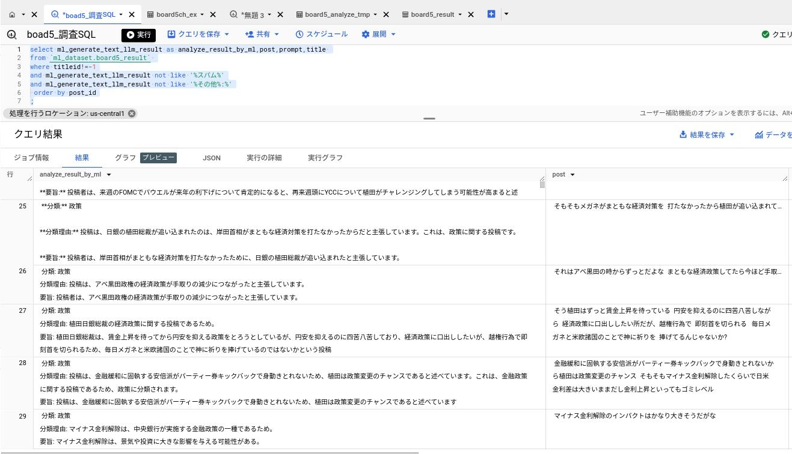
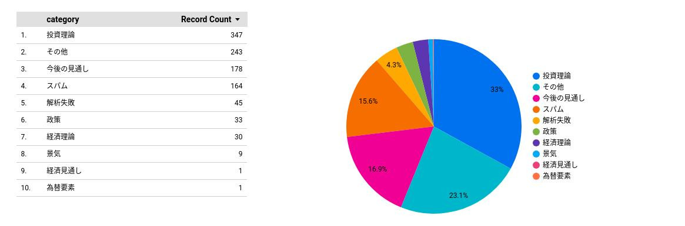
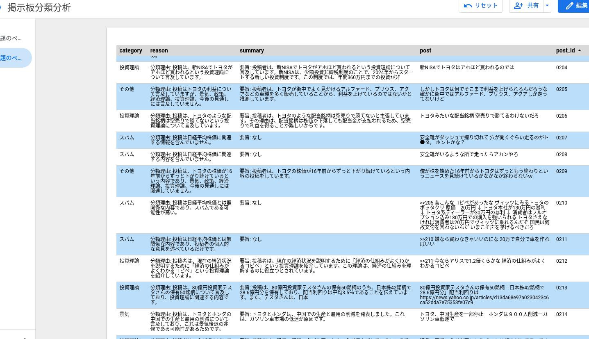
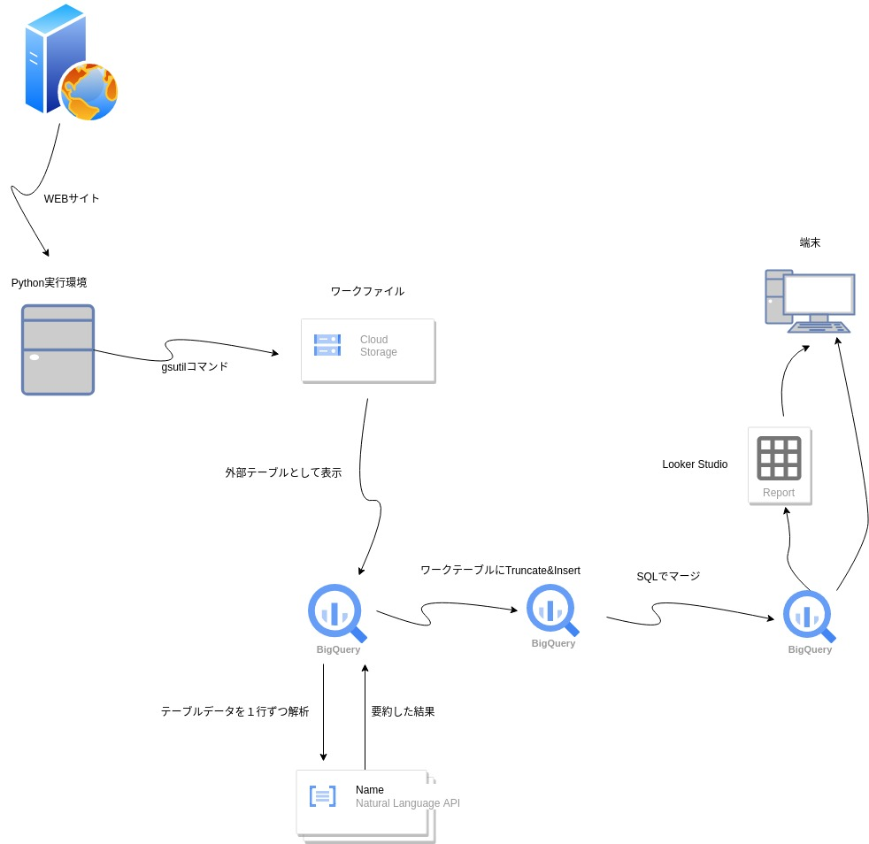

# ##機能概要

掲示板系WEBサイトにはすばらしい情報があるが、スパムやテーマとは無関係の投稿も存在し利用には時間コストを要する。

本システムは**Python**、**GCP**の**Bigquery**、**Vertex AI**を使って以下のように問題を軽減することを目的としている。

掲示板系WEBサイトの投稿がスパムか判定する。

スパムでない場合は投稿を特定のカテゴリーで分類する。

それぞれの投稿を要約し読むべきか事前に短時間で判断できるようにする。


# ##最終アウトプットのサンプルイメージ
下記は日経平均株価がテーマのある掲示板を本システムで解析した結果である。



上記の左側の列がVertex AIが出力した投稿の分類と要約。右側が元の投稿である。

SQLで**スパム**に分類された投稿は非表示にしている。

上記のように投稿を分析した結果によって、ユーザーの掲示板の利用をサポートする。


下記はBigqueryの正規表現とLooker studioを使って上記の解析結果をレポート化したものである。
分類ごとのカウントから関心が強い投稿の多い掲示板かどうか判断できる。

**■分類集計レポート：日経平均がテーマのある掲示板についてAIが判定した投稿の分類ごとのカウント**


下記の明細レポートでは、**スパム**と分類されたものは読まない、関心のある分類の投稿にフォーカスして読む等、効率的に掲示板の情報を活用できる。

**■明細レポート:日経平均がテーマのある掲示板についてAIが判定した投稿ごとの分類と要約**



# ##システム構成



テクノロジーとしては**Python**、**GCP**の**Bigquery**、**Vertex AI** を利用している。


# ##前提
## 基本技術の説明について
ここでは基本的な技術要素については記載していない。
※ 主に自身のポートフォリオを目的に作成しています。

使用しているAI機能については下記サイト(G-genさん)を参考にしているので必要に応じて参照してほしい。
※ 非常にわかりやすいです。

> https://blog.g-gen.co.jp/entry/using-palm2-with-bigquery-ml

## WEBからのデータ抽出について
個人的利用のためのデータ抽出は法律で許可されていますが、それを公開することは許可されていないので、個人利用に留めてください。
抽出したデータ（および加工後のデータ）を公開する場合はWEBサイトの所有者に許可を取る必要があります。


# ##処理プロセス

## 処理コード全体（bashのスクリプト)
```
#!/bin/bash

source ./private/env.sh

rm -f ${BOARD5TMP_DIR}/${BOARD5TMP_FILE}

python ./board5_getWeb.py

gsutil cp ${BOARD5TMP_DIR}/${BOARD5TMP_FILE} ${BOARD5GCS_DIR}

#初回のみテーブル作成を実行
#bq rm -t ml_dataset.board5_ex
#bq mk -t --schema ./schema/board5_schema.json \
#--external_table_definition=${BOARD5GCS_DIR}/${BOARD5TMP_FILE}  \
#ml_dataset.board5_ex

#初回のみテーブル作成を実行
#bq rm -t ml_dataset.board5_analyze_tmp
#bq mk -t --schema ./schema/board5_schema_result.json \
  #ml_dataset.board5_analyze_tmp

bq query --use_legacy_sql=false 'delete from `ml_dataset.board5_analyze_tmp` where 1=1'
for ((i=0; i<1; i++))  do  
	bq query --use_legacy_sql=false   \
	 --parameter='mlimit:INT64:100' \
	 --parameter='disc:STRING:以下は日経平均株価に関する掲示板の投稿です。\n      投稿:' \
	 --parameter='request:STRING:\n     投稿を次のどれかに分類してください。「景気」「政策」「経済理論」「投資理論」「今後の見通し」「その他」「スパム」。また分類理由を記載してください。また「スパム」以外については投稿の要旨を記載してください。 ' \
	 --parameter='answer:STRING:\n      分類: \n 分類理由: \n 要旨:' \
	  <board5_analyze.sql
done 

#初回のみテーブル作成を実行
#bq rm -t ml_dataset.board5_result
#bq mk -t --schema ./schema/board5_schema_result.json \
#--require_partition_filter=true  \
#--range_partitioning=titleid,0,1000,1 \
#ml_dataset.board5_result


#データをクリアしたいときのみ
bq query --use_legacy_sql=false 'delete from `ml_dataset.board5_result` where titleid < 100000000'

bq query --use_legacy_sql=false <board5_merge.sql

#初回のみVIEW作成を実行
#bq mk --use_legacy_sql=false --view_udf_resource=./board5_result_view.sql \
#ml_dataset.board5_result_view

exit

```
※ 下記で上記のそれぞれのコードを説明している。


## 環境変数の設定
```
source ./private/env.sh
```

セキュリティ、保守性を考慮し環境変数を外から読み込む。
以降で使用されている変数にはここで読み込んだ値が反映される。

## 事前のワークファイルの削除
```
rm -f ${BOARD5TMP_DIR}/${BOARD5TMP_FILE}
```


## Pythonでスクレイピング

```
python ./board5_getWeb.py
```
[board5_getWeb.py](./board5_getWeb.py)


対象のデータをWEBサイトから収集して、ローカルのワークファイルに出力している。
ライブラリとしてBeautifulSoupを使用している。

**ポイント:**

	- 今回は5chの掲示板データのスクレイピングに特化したコードとなっている。
	- それぞれのサイトごとにHTML、CSSの構造を解析してコーディングする必要がある。
	- HTML、CSSの構造の解析にはChromeのDeveloper toolが役立つ。

下記ビジPyさんのサイトでBeautifulSoupについて分かり易く説明されている。
> https://ai-inter1.com/beautifulsoup_1/

<br><br><br><br><br><br> 
   
   
   
   
   
## 上記で取得したワークファイルをGCSにロード
```
gsutil cp ${BOARD5TMP_DIR}/${BOARD5TMP_FILE} ${BOARD5GCS_DIR}
  
```
  
  
  
  
  
## Bigqueryの外部データ連携機能でGCSのワークファイルを直接参照する外部テーブルを作成する。

下記のスキーマ情報から外部テーブルを作成する。

※ 1回目のみ実行する。
```

bq rm -t ml_dataset.board5_ex
bq mk -t --schema ./schema/board5_schema.json \
--external_table_definition=${BOARD5GCS_DIR}/${BOARD5TMP_FILE}  \
ml_dataset.board5_ex
```

[スキーマ情報:schema_5chboard.json](./schema/board5_schema.json)

上記でGCSにコピーした掲示板のcsvファイルをソースとした外部テーブルを作成している。


## 解析結果を一時補完するワークテーブルを作成

※ 1回目のみ実行する。

```
bq rm -t ml_dataset.board5_analyze_tmp
bq mk -t --schema ./schema/board5_schema_result.json \
  ml_dataset.board5_analyze_tmp
```

[スキーマ情報:board5_schema_result.json](./schema/board5_schema_result.json)


## Bigquery MLで 解析実行とワークテーブルに投入

```
bq query --use_legacy_sql=false 'delete from `ml_dataset.board5_analyze_tmp` where 1=1'

for ((i=0; i<5; i++))  do  
	bq query --use_legacy_sql=false   \
	 --parameter='mlimit:INT64:10' \
	 --parameter='request:STRING:以下はアーリーリタイアに関する掲示板の投稿です。次のどれかに分類してください。「節税」「生活費」「投資」「資産運用」「過ごし方」「リタイア成功の条件」「リタイアのリスク」「その他」「スパム」。また分類理由を記載してください。また「スパム」以外については要旨を記載してください。 \n 投稿:' \
	 --parameter='category:STRING:\n 分類: \n 分類理由: \n 要旨:' \
	  <board5_analyze.sql
	  <board5_analyze.sql
done 
```

[Vertex AIと連携するSQL:board5_analyze.sql](./board5_analyze.sql)

**ポイント：**

	- 外部テーブルからSelectしたデータをBigquery ML(Vertex AI)で解析して結果を上記で作成した
	一時テーブルにロードしている。

	- 一度に大量に処理をするとVertex AIのリソースオーバーで異常終了してしまうので分割して処理をしている。

	- パラメーターでAIにプロンプトから指示する内容を渡している。内容はそれぞれの掲示板のテーマに合わせて考える必要がある。ここでは、分類と要約をお願いしている。

	- NOT EXISTS句で既に処理したデータはスキップしている。効率的ではないがそれほど大量データではないので保守性を考えるとこの方式が良いと判断した。


## 解析結果を蓄積するテーブルを作成

※ 1回目のみ実行する。

```
bq rm -t ml_dataset.board5_result
bq mk -t --schema ./schema/board5_schema_result.json \
  --require_partition_filter=true  \
  --range_partitioning=titleid,0,1000,1 \
  ml_dataset.board5_result
```

解析結果を蓄積することから大量データとなる可能性がある。対策としてパーティションテーブルを採用している。
パーティションキーは上記のスクレイピングで掲示板タイトルからハッシュ関数で生成したTitleidとしている。

## 解析結果をテーブルにマージで投入or更新

```
bq query --use_legacy_sql=false <board5_merge.sql
```

[投入or更新をするMerge用SQL:board5_merge.sql](./board5_merge.sql)

マージ文で既に存在する場合は上書き、新規の場合は投入している。

## ViewによりAIの解析結果を見易くする。

[View:board5_result_view.sql](./board5_result_view.sql)

上記VIEW作成スクリプトをBigqueryのコンソールから実行する。

AIが出力した情報には統一性がなかったり、余分な文字が含まれていたりする。
レポート化し易いようにこれらをBigqueryの正規表現を使って補正している。


# ##環境セットアップ
Centos9にPythonの実行環境、GCPにBigquery MLの実行環境を構築する。
尚、Python、Google cloud sdk の基本的なセットアップは完了していることを前提としている。


## Setup Python virtul env 
```
cd ../env
python3.9 -m venv scraping
source ./scraping/bin/activate

pip install --upgrade pip
pip install  requests
pip install  bs4
pip install  pandas 
pip install  html5lib

deactivate

```

## Python debug

デバッグのコードも記載しておく

```
python -m pdb  exsample.py 
#p(変数)
#pp(変数)
#b ブレイクする行番号
#c #コンティニュー
#pp(article[5].prettify())

```


## Setup Bigquery for vertex

Connection を作成する
```
bq mk --connection \
    --location=${LOCATION} \
     --project_id=${PROJECT_ID} \
    --connection_type=CLOUD_RESOURCE ${CONNECTION_ID}
```

利用されるサービスアカウントの表示
```
bq show --connection ${PROJECT_ID}.${LOCATION}.${CONNECTION_ID}
```

サービスアカウントへの権限設定
```
gcloud projects add-iam-policy-binding ${PROJECT_ID} \
    --member="serviceAccount:${SERVICE_ACCOUNT_ID}" \
    --role="roles/aiplatform.user"
```

MLモデル作成

Bigqueryコンソールで実行
```
CREATE OR REPLACE MODEL ml_dataset.lang_model_v1
  REMOTE WITH CONNECTION `us-central1.con-pro-ml-for-bq`
  OPTIONS (remote_service_type = 'CLOUD_AI_LARGE_LANGUAGE_MODEL_V1');
```
